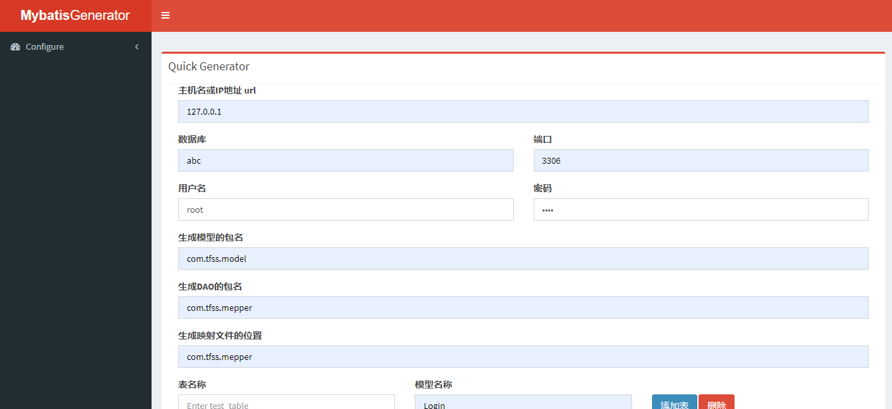

<h1 align="center"><a href="https://github.com/tfssweb" target="_blank">Tfss-Generator</a></h1>

      

# 简介：
> :whale: :whale: :whale:

> Tfss-Generator。 开源地址：https://github.com/tfssweb/tfss-learn

> 开发作者：[颓废书生](https://tfssweb.github.io/)

> Mybatis Generator，你可以`Fork`到您的仓库进行备份，因收集整理不易，还望给笔者一个`Star`哦！

> :whale: :whale: :whale:

# 技术栈

- generator
- java
- mybatis

## 相关链接：

- [个人博客](https://tfssweb.github.io/)
- [Github链接](https://github.com/tfssweb/)

## 公众号

> 微信搜索：颓废书生

> 公众号分享技术文章、毕业设计等相关内容。

